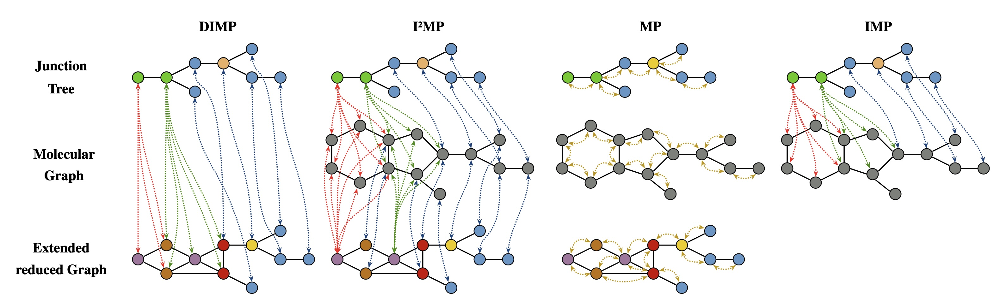

# XIMP: Cross Graph Inter-Message Passing


## Requirements
- Linux with an x86 Processor

## Installation
Install all dependencies in a conda environment defined in `environment.yml`

```
conda env create -f environment.yml
```

and activate the environment

```
conda activate ximp
```

## Experiments
Every individual run will output a unique file in the `results` folder (ensure this folder exists before running), containing the hyperparameter configuration, the mean validation loss, the standard deviation on the validation loss, and the MAE on the test scaffold.

### Single Run
To execute a single run, pass the hyperparameter configuration as flags to `main.py`. Details on default values and available options can be shown by calling the help function:

```
python main.py --help
```

Example 1: Run a sample run with the default hyperparameter configuration:
```
python main.py
```

Example 2: Use `XIMP` to perform molecular property prediction on the `admet` task, specifically the `MLM` endpoint. Do not use an ErG tree abstraction, but do use a junction tree abstraction with a coarseness values of 2

```
python main.py --repr_model="XIMP" --task="admet" --target_task="MLM" --use_erg="FALSE" --use_jt="TRUE" --jt_coarsity=2
```

### Batch Run
To execute multiple hyperparameter configurations in parallel, use `main_batch.py` and define the hyperparameters to be used in a `csv` file. Sample hyperparamters to reproduce the results shown in the paper can be found in the `hyperparameters` folder. Be sure to set the hyperparameter filename at the top of the `main_batch.py` file. Default: "global_best_params.csv".

```
python main_batch.py
```

`evaluation.ipynb` lets you evaluate the results to reproduce the tables mentioned in the paper.

## Datasets
We investigate 2 datasets, each containing multiple regression tasks:

MoleculeNet:
- ESOL
- FreeSolv
- Lipophilicty

Polaris:
- HLM
- KSOL
- LogD
- MDR1-MDCKII
- MLM
- pIC50 (MERS-CoV Mpro)
- pIC50 (SARS-CoV-2 Mpro)
